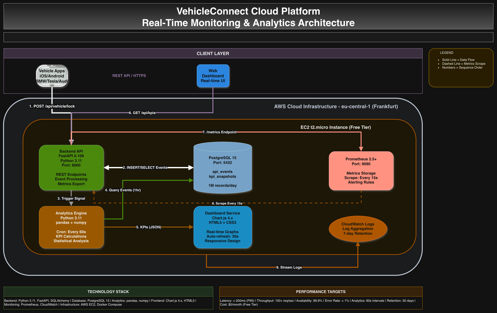

# 🏗️ VehicleConnect Cloud Platform - Architecture

## 🎯 System Overview

**VehicleConnect** monitors **connected vehicle backend services** with:

- Real-time KPI tracking
- Automated analytics
- Interactive dashboard
- Cloud deployment

**Real-world equivalent:**
This simulates the operations layer for automotive cloud platforms.

## 🗺️ High-Level Architecture



_Professional architecture diagram showing the complete data flow through VehicleConnect Cloud Platform_

## -------------------------------------------------------------------------

## 🔧 Component Breakdown

### 1. Backend API (FastAPI)

Technology: Python 3.11 + FastAPI
Port: 8000
Endpoints:
GET /api/status ← Health check
POST /api/events ← Record vehicle events
GET /api/analytics/kpis ← Get KPI data
GET /metrics ← Prometheus metrics

**Responsibilities:**

- Handle vehicle API requests
- Store events in database
- Expose Prometheus metrics
- Serve dashboard data

**Why FastAPI:**

- Fastest Python framework
- Automatic API docs (/docs)
- Type hints (fewer bugs)
- Async support (handles more traffic)

### 2. PostgreSQL Database

Technology: PostgreSQL 15
Port: 5432
Tables:
api_events ← Raw request data
kpi_snapshots ← Calculated metrics

**Why PostgreSQL:**

- Industry standard (Apple, Netflix)
- ACID compliant (data never lost)
- Great for analytics (JSON support)
- Free tier friendly

### 3. Analytics Engine

Technology: Python + pandas + numpy
Runs: Every minute (cron job)

Input: Raw events from database
Output: Calculated KPIs

**Calculations:**
Average latency = SUM(response_time) / COUNT
P95 latency = 95th percentile of response times
Error rate = (errors / total) \* 100

### 4. Dashboard Frontend

Technology: HTML5 + Chart.js + JavaScript
Access: http://localhost:8000/dashboard

Features:

KPI cards (real-time numbers)

Interactive charts

Auto-refresh (30 seconds)

Responsive design

**Why Chart.js:**

- Lightweight (no framework needed)
- Great documentation
- 20+ chart types
- Responsive (mobile-friendly)

### 5. Prometheus Monitoring

Technology: Prometheus 2.5+
Port: 9090
Scrapes: Backend /metrics endpoint every 15s

**Metrics tracked:**
api_requests_total{method="GET", endpoint="/api/status"}
api_request_duration_seconds{method="POST", endpoint="/api/events"}

### 6. AWS Infrastructure

EC2: t2.micro (free tier)
Region: eu-central-1 (Frankfurt - close to Berlin)
Security Group: Ports 22, 80, 8000, 9090
IAM Role: EC2FullAccess + CloudWatchFullAccess

## 📊 Data Flow (Request Journey)

**Scenario:** Vehicle app unlocks car remotely

Vehicle App → POST /api/vehicle/lock
{
"endpoint": "/api/vehicle/lock",
"response_time_ms": 45.3,
"status_code": 200,
"client_id": "vehicle_00123"
}

FastAPI Backend:

Validates JSON

Saves to PostgreSQL

Updates Prometheus counters

Returns 201 Created

Database stores:
INSERT INTO api_events VALUES (...)

Analytics (next minute):
SELECT \* FROM api_events WHERE timestamp > NOW() - INTERVAL '1 hour'
→ Calculate KPIs
→ Save to kpi_snapshots

Dashboard fetches:
GET /api/analytics/kpis → JSON → Chart.js graphs

Prometheus scrapes:
GET /metrics → Time series data

## 🐳 Docker Architecture

**Why Docker:**
❌ Without Docker:
"Works on my Mac but not on AWS"

✅ With Docker:
Same environment everywhere
Easy deployment
Isolation

**docker-compose.yml (orchestration):**

```yaml
services:
  backend:     # FastAPI + Python
    image: python:3.11
    ports: ["8000:8000"]

  postgres:    # Database
    image: postgres:15
    ports: ["5432:5432"]

  prometheus:  # Monitoring
    image: prom/prometheus
    ports: ["9090:9090"]


Local vs Production:

Local (your Mac):
docker-compose up -d
http://localhost:8000/dashboard

Production (AWS):
Same docker-compose.yml
http://3.123.45.67:8000/dashboard
🔒 Security Architecture


1. AWS Security Groups (firewall):
   Allow: 22(SSH), 80(HTTP), 8000(API), 9090(Prometheus)
   Block: Everything else

2. SSH Key Authentication:
   Private key on your Mac
   Public key on AWS
   No passwords!

3. Environment Variables:
   .env file (gitignored):
   DATABASE_PASSWORD=secret123

4. IAM Roles:
   EC2 instance has minimum permissions


📈 Scalability Path
Current (Day 6):


1 EC2 instance
All services on 1 box
Free tier
Production Scale:


Load Balancer (ALB)
Multiple EC2 instances
RDS PostgreSQL (managed DB)
Redis caching
CloudFront CDN
Auto Scaling Groups
Multi-region deployment
🧪 Testing Strategy

Unit Tests (pytest):
- API endpoints
- KPI calculations
- Database models

Integration Tests:
- Full request flow
- Docker compose up + tests

Load Tests:
- Simulator generates 100 req/sec
- Monitor latency + errors
📋 Deployment Process

GitHub Actions CI/CD:
1. Push to main branch
2. Run pytest tests ✅
3. Build Docker images
4. SSH to AWS EC2
5. docker-compose up -d --build
6. Health check: curl /api/status
7. Notify: "Deployment successful!"

## -----------------------------------------------------------
🎯 Why This Architecture Wins Interviews

✅ Cloud-native (AWS + Docker)
✅ Microservices pattern
✅ Observability (Prometheus + Dashboard)
✅ DevOps practices (CI/CD)
✅ Business focus (KPIs)
✅ Scalable design
✅ Production-ready
✅ Well-documented
## -----------------------------------------------------------
Interview talking points:

1. "This uses the same patterns as automotive cloud platforms"
2. "Complete observability stack: metrics, logs, dashboards"
3. "Zero-downtime deployments with health checks"
4. "Scales from prototype to production"
```
